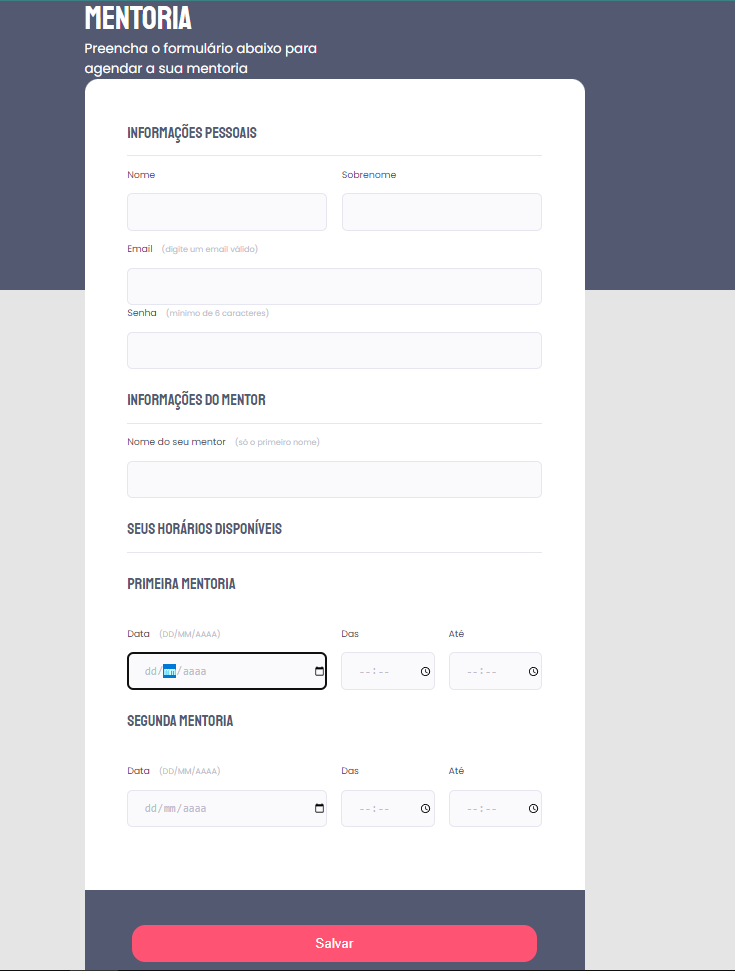

# Criação de uma página web usando HTML e CSS

Essa página foi feita com objetivo de colocar em praticas conteudos visto em aulas do curso explorer da Rocketseat.
Coteudo visto:
- HTML
- CSS
- criacao de formularios
- alguns tipos de input existentes no HTML: text, password, number, checkbox. Tags: select e text-area.
- como funciona os formulários no HTML seus atributos action e method e os tipos de métodos que podem ser passados através de um formulário (GET e POST) 
- como funciona uma busca do Google. Utilizando a tag <form> para passar os inputs do tipo text, hidden e submit

## Resultado Final

## 🔗 Links

